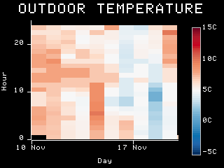

House Dashboard
====

An application to display various kinds of charts on a house dashboard.

<https://gitlab.com/claudiomattera/house-dashboard/>

This application can be used to display room temperature, humidity and air quality; water and heating meters readings; weather forecast; and any other kinds of data available.

It is designed to run on a [Raspberry Pi 0 W] equipped with a TFT 320×240 display and running [Raspbian Buster], but it should be possible to run it on most platforms.
The dashboard is implemented in [Rust] and it fetches data from an [InfluxDB]
database, which are displayed using [Plotters], a Rust crate for creating charts.

[Raspberry Pi 0 W]: https://www.raspberrypi.org/products/raspberry-pi-zero-w/
[Raspbian Buster]: https://www.raspberrypi.org/downloads/raspbian/
[Rust]: https://www.rust-lang.org/
[InfluxDB]: https://www.influxdata.com/products/influxdb-overview/
[Plotters]: https://crates.io/crates/plotters

Installation
----

Executables for Linux can be found in the [releases page](https://gitlab.com/claudiomattera/house-dashboard/-/releases).

### From source

This application can be compiled using the Rust toolchain.

~~~~shell
cargo build --release
~~~~

The resulting executable will be created in `target/release/house-dashboard`.

Usage
----

This is a command-line application.
Charts can be either be saved as BMP file or displayed directly on the framebuffer, depending on which command is used.
The charts are defined in a configuration file which is passed to the application through a command-line argument.

~~~~plain
house-dashboard -v --configuration /path/to/conf.toml \
    save --path /path/to/generated/charts
~~~~

The `--help` argument describes the command-line interface in details.

~~~~plain
> house-dashboard --help
house-dashboard 0.1.0
Claudio Mattera <claudio@mattera.it>
An application to generate and display charts for a house dashboard

USAGE:
    house-dashboard [FLAGS] --configuration <configuration-path> [SUBCOMMAND]

FLAGS:
    -h, --help       Prints help information
    -V, --version    Prints version information
    -v, --verbose    Sets the level of verbosity

OPTIONS:
    -c, --configuration <configuration-path>    Path to configuration file

SUBCOMMANDS:
    display    Display charts on the framebuffer
    help       Prints this message or the help of the given subcommand(s)
    save       Save charts to files

~~~~

### Saving Charts

Charts can be saved as BMP images using the subcommand `save`.
They can be displayed on the framebuffer using an application such as [FBI], included in webpages, sent by email...

~~~~plain
> house-dashboard save --help
house-dashboard-save
Save charts to files

USAGE:
    house-dashboard --configuration <configuration-path> save [FLAGS] --path <path>

FLAGS:
        --clear      Clears all .bmp files in charts directory
    -h, --help       Prints help information
    -V, --version    Prints version information

OPTIONS:
    -p, --path <path>    Path to charts directory
~~~~

[FBI]: https://linux.die.net/man/1/fbi

### Displaying Charts on the Framebuffer

Charts can be displayed on the framebuffer using the subcommand `display`.

~~~~plain
> house-dashboard display --help
house-dashboard-display
Display charts on the framebuffer

USAGE:
    house-dashboard --configuration <configuration-path> display --device <device>

FLAGS:
    -h, --help       Prints help information
    -V, --version    Prints version information

OPTIONS:
    -d, --device <device>    Path to framebuffer device
~~~~

### Configuration

A [TOML] configuration file is used to define what charts to generate, how to fetch data, and other generic options.

~~~~toml
# Options related to all charts style
[style]
# Font settings (must be available as system font)
font = "Apple ]["
font_scale = 1

# Colour palette for charts (Dark/Light)
system_palette = "Dark"
series_palette = "ColorbrewerSet1"

# Resolution of generated images (should be the same as the screen)
resolution = [320, 240]

# Options related to the InfluxDB server
[influxdb]
# URL of the InfluxDB server
url = "https://influxdb_hostname:8086"

# Optional path to certificate (necessary if using HTTPS with a self-signed certificate)
cacert = "/path/to/certificate.pem"

# Optional flag to accept invalid certificates
dangerously_accept_invalid_certs = false

# Database name
database = "longterm"

# Username
username = "dashboard"

# Password
password = "[REDACTED]"

# Multiple [[charts]] sections, each generates a chart
[[charts]]
# Chart type
kind = "Trend"

# Optional chart title
title = "TEMPERATURE"

# Optional chart Y label
ylabel = "Temperature"

# Optional chart Y label
yunit = "C"

# InfluxDB database
database = "house"

# InfluxDB measurement
measurement = "indoor_environment"

# InfluxDB field
field = "temperature"

# Tag used in the GROUP BY $TAG clause
tag = "room"

# Optional maximal age of readings
how_long_ago = "P1D"

# Expected tag values
tag_values = ["living room", "bedroom", "bathroom", "entrance", "kitchen"]

# Format for x label
xlabel_format = "%H:%M"

# Multiple [[regions]] sections, each defines a region in geographical
# heatmap charts
[[regions]]
name = "living room"
coordinates = [
  [2.0, 1.0],
  [4.75, 1.0],
  [4.75, 1.8],
  [5.5, 1.8],
  [5.5, 5.8],
  [4.75, 5.8],
  [4.75, 6.5],
  [1.9, 6.5],
  [1.9, 8.4],
  [0.8, 8.4],
  [0.8, 4.1],
  [2.0, 4.1],
]
~~~~

[TOML]: https://github.com/toml-lang/toml

License
----

Copyright Claudio Mattera 2020

You are free to copy, modify, and distribute this application with attribution under the terms of the [MIT license]. See the [`License.txt`](./License.txt) file for details.

[MIT license]: https://opensource.org/licenses/MIT
