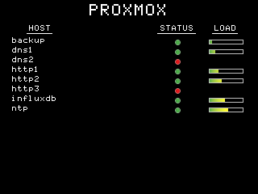

House Dashboard
====

An application to display various kinds of charts on a house dashboard.

<https://gitlab.com/claudiomattera/house-dashboard/>

This application can be used to display room temperature, humidity and air quality; water and heating meters readings; weather forecast; infrastructure summary; and any other kind of data available.

It is designed to run on a [Raspberry Pi 0 W] equipped with a TFT 320×240 display and running [Raspbian Buster], but it should be possible to run it on most platforms.
The dashboard is implemented in [Rust] and it fetches data from an [InfluxDB]
database, which are displayed using [Plotters], a Rust crate for creating charts.

[Raspberry Pi 0 W]: https://www.raspberrypi.org/products/raspberry-pi-zero-w/
[Raspbian Buster]: https://www.raspberrypi.org/downloads/raspbian/
[Rust]: https://www.rust-lang.org/
[InfluxDB]: https://www.influxdata.com/products/influxdb-overview/
[Plotters]: https://crates.io/crates/plotters

Installation
----

This application can be compiled using the Rust toolchain.

~~~~shell
# Install dependencies if building on x86_64
apt-get install --yes libseccomp-dev

# Create the binary in `target/release/house-dashboard`
just build-release

# Create a Debian package in `target/debian/house-dashboard_1.0.0_amd64.deb`
just deb
~~~~

Usage
----

This is a command-line application that saves charts as BMP images.

Watch a [screen cast of running the application](./docs/run.cast).

The charts are defined in a configuration directory which is passed to the application through a command-line argument.

~~~~plain
house-dashboard -v \
    --configuration-directory /path/to/configuration/ \
    --output-directory /path/to/generated/charts
~~~~

The `--help` argument describes the command-line interface in details.

~~~~plain
> house-dashboard --help
Create dashboard images

Usage: -v... -c PATH [-o PATH]

Available options:
    -v, --verbose                         Verbosity level
    -c, --configuration-directory <PATH>  Path to configuration directory
    -o, --output-directory <PATH>         Path to output directory (default: .)
    -h, --help                            Prints help information
~~~~

### Configuration

The configuration directory must contain the following [TOML] files:

- `influxdb.toml`: configures the address and credentials of the InfluxDB server.
- `style.toml`: configures the appearance of generated charts.
- `*.toml`: each of those files configures an individual chart.

[TOML]: https://github.com/toml-lang/toml

#### InfluxDB Configuration

File `influxdb.toml` is used to specify the connection to the InfluxDB server, and must contain the following information:

~~~~toml
url = "https://influxdb.example.com:8086"
# cacert = "/path/to/custom/certification/authority/root.crt"
# dangerously_accept_invalid_certs = false
username = "some-user-name"
password = "some-password"
~~~~

Parameters `url`, `username` and `password` should be self-explanatory.
Parameter `cacert` can be optionally used to specify a custom certification authority.
Parameter `dangerously_accept_invalid_certs` can be used to disable TLS validation.

#### Style Configuration

File `style.toml` is used to specify charts style, and must contain the following information:

~~~~toml
font_name = "FontName"
font_path = "FontName.ttf" # Relative to the configuration directory
font_scale = 1
system_palette = "Light"
series_palette = "ColorbrewerSet1"
resolution = [320, 240]
~~~~

A custom font and font file must be specified, and the font name must correspond to the font file.
There are two system palettes: `Light` and `Dark`, and three series palettes: `ColorbrewerSet1`, `ColorbrewerSet2` and `ColorbrewerSet3`.

Recommendation: font [Print Char 21] works quite well for small displays.

[Print Char 21]: https://www.kreativekorp.com/software/fonts/apple2/

#### Chart Configuration

Each of the other `.toml` files defines a specific chart.

Charts can be of several types:

* Infrastructure: Show the status and load of physical servers (measurement `system` in database `telegraf`, limited to hosts with tag `always-on` equal to `true`).
* Proxmox: Show the status and load of virtual machines and containers (measurement `proxmox` in database `telegraf`, limited to hosts with tag `node-fqdn` equal to the value specified).
* Trend: Show a line chart.
* Geographical heat-map: Show a geographical heat-map on regions defined in the configuration file.
* Temporal heat-map: Show a temporal heat-map of a measurement over time.

##### Infrastructure Chart

Display the status of physical infrastructure, and an optional time of last update.

The configuration file must contain the following information:

~~~~toml
kind = "InfrastructureSummary"
title = "INFRASTRUCTURE"
how_long_ago = "PT30M"
suffix = ".example.com" # This is stripped from hostnames
last_update_format = "Updated %A at %H:%M"
vertical_step = 18
~~~~

##### Proxmox Chart

Display the status of Proxmox infrastructure.

The configuration file must contain the following information:

~~~~toml
kind = "ProxmoxSummary"
title = "PROXMOX"
how_long_ago = "PT30M"
suffix = ".example.com" # This is stripped from hostnames
vertical_step = 8
node_fqdn = "proxmox.example.com"
~~~~

##### Trend Chart

Display a trend over time.

The configuration file must contain the following information:

~~~~toml
kind = "Trend"
title = "Temperature"
ylabel = "Temperature"
yunit = "C"
database = "house"
measurement = "indoor_environment"
field = "temperature"
tag = "room" # Show one line per tag value
scale = 1
how_long_ago = "P1D"
how_often = "PT1H" # Resample to this period
xlabel_format = "%H:%M"
draw_last_value = true
hide_legend = false
max_x_ticks = 6
draw_horizontal_grid = true
# min_y_range = 12
~~~~

##### Geographical Heat-map Chart

Display a heatmap over multiple geographical regions.

The configuration file must contain the following information:

~~~~toml
kind = "GeographicalHeatMap"
title = "TEMPERATURE"
unit = "C"
database = "house"
measurement = "indoor_environment"
field = "temperature"
tag = "room"
how_long_ago = "P1D"
bounds = [15, 35]
colormap = "CoolWarm"
isometric = true
# right_margin = 55

[[regions]]
name = "living room"
coordinates = [
  [0.0, 0.0],
  [0.0, 1.0],
  [1.0, 1.0],
  [1.0, 0.0],
]

[[regions]]
name = "bedroom"
coordinates = [
  [1.0, 0.0],
  [1.0, 1.0],
  [2.0, 1.0],
  [2.0, 0.0],
]

[[regions]]
name = "kitchen"
coordinates = [
  [0.0, 1.0],
  [0.0, 2.0],
  [1.0, 2.0],
  [1.0, 1.0],
]

[[regions]]
name = "bathroom"
coordinates = [
  [1.0, 1.0],
  [1.0, 2.0],
  [2.0, 2.0],
  [2.0, 1.0],
]
~~~~

##### Temporal Heat-map Chart

Display a heatmap over time.

The configuration file must contain the following information:

~~~~toml
kind = "TemporalHeatMap"
title = "OUTDOOR TEMPERATURE"
unit = "C"
database = "house"
measurement = "outdoor_environment"
field = "temperature"
aggregator = "mean"
tag = "address"
tag_value = "some address"
period = "HourOverDay"
# bounds = [-20, 0]
colormap = "CoolWarm"
# right_margin = 55
~~~~

#### Colour Maps

For those charts that use colour maps and colour bars, the following are supported:

* `CoolWarm` (`#053061`, `#2166ac`, `#0571b0`, `#4393c3`, `#67a9cf`, `#92c5de`, `#d1e5f0`, `#f7f7f7`, `#fddbc7`, `#f4a582`, `#ef8a62`, `#d6604d`, `#ca0020`, `#b2182b`, `#67001f`)
* `Blues` (`#f7fbff`, `#deebf7`, `#c6dbef`, `#9ecae1`, `#6baed6`, `#4292c6`, `#2171b5`, `#08519c`, `#08306b`)
* `Reds` (`#fff5f0`, `#fee0d2`, `#fcbba1`, `#fc9272`, `#fb6a4a`, `#ef3b2c`, `#cb181d`, `#a50f15`, `#67000d`)
* `Greens` (`#f7fcf5`, `#e5f5e0`, `#c7e9c0`, `#a1d99b`, `#74c476`, `#41ab5d`, `#238b45`, `#006d2c`, `#00441b`)
* `Oranges` (`#fff5eb`, `#fee6ce`, `#fdd0a2`, `#fdae6b`, `#fd8d3c`, `#f16913`, `#d94801`, `#a63603`, `#7f2704`)
* `Violets` (`#fcfbfd`, `#efedf5`, `#dadaeb`, `#bcbddc`, `#9e9ac8`, `#807dba`, `#6a51a3`, `#54278f`, `#3f007d`)
* `Grays` (`#ffffff`, `#f0f0f0`, `#d9d9d9`, `#bdbdbd`, `#969696`, `#737373`, `#525252`, `#252525`, `#000000`)
* `Status` (`#4daf4a`, `#ffff33`, `#e41a1c`)

### Retry on Errors

All charts in the configuration are generated simultaneously.
If generation for any of them fails, it will be retried four times with exponential backoff, for a total of about one minute.
This allows to survive short network issues without delaying execution for too long.

Changes
----

See the [Changelog](./Changelog.md) for a list of changes.

License
----

Copyright Claudio Mattera 2023

You are free to copy, modify, and distribute this application with attribution under the terms of the [MPL 2.0 license]. See the [`License.md`](./License.md) file for details.

[MPL 2.0 license]: https://opensource.org/licenses/MPL-2.0
